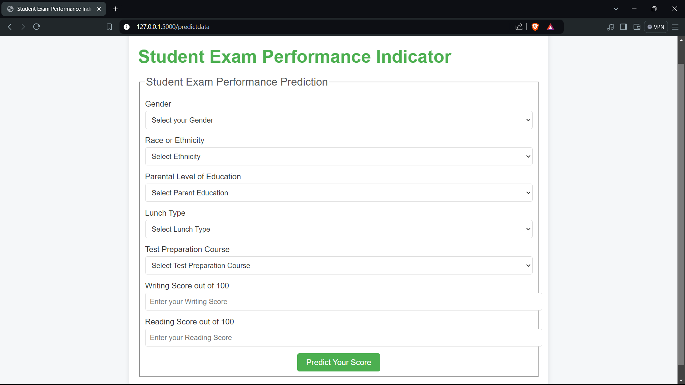

# EduPredict: Machine Learning Insights for Academic Performance




## Project Overview

EduPredict is a machine learning application designed to provide insights into academic performance. With an 89% success rate, this application leverages Python-based scripts to train, deploy, and evaluate machine learning models locally.

## Key Achievements

- **Developed and deployed a machine learning application** with an 89% success rate.
- **Streamlined local execution** using Python commands and pre-configured scripts.
- **Optimized performance** through efficient code and dependency management.

## Getting Started

### Prerequisites

- I have Python 3.13.1 Installed
- Pip (Python package installer)

### Setup

1. **Create and activate a virtual environment:**
    ```bash
    python -m venv venv
    venv\Scripts\activate
    ```

2. **Install dependencies:**
    ```bash
    pip install -r requirements.txt
    ```

### Running the Application

1. **Train the model:**
    ```bash
    python -m src.pipeline.train_pipeline
    ```

2. **Run the application:**
    ```bash
    python application.py
    ```

### Usage

- **Training Script:** `train_pipeline.py` trains the machine learning model and saves it to disk.
- **Application Script:** `application.py` runs the application and serves predictions.

## Troubleshooting

- **Dependency Issues:**
    - Ensure all packages are installed correctly using `pip install -r requirements.txt`.
    - Check for any missing or outdated packages.

- **Execution Errors:**
    - Verify Python version compatibility.
    - Check logs for detailed error messages.


